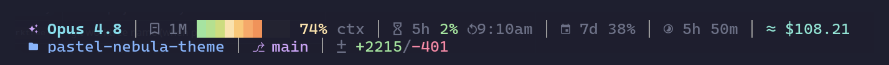

<div align="center">

# vitals

**Your Claude Code session's vital signs, at a glance.**

A fast, modular status line for [Claude Code](https://code.claude.com) — model, context, rate
limits, cost, git, and more — rendered as composable segments you fully control.



[](https://github.com/thissayantan/vitals/actions/workflows/ci.yml)
[](https://github.com/thissayantan/vitals/releases)
[](LICENSE)

</div>

---

## Why vitals

- ⚡ **Fast** — a single static Go binary, ~5ms cold start. It renders on *every* Claude Code update
  (debounced 300ms), so speed matters. No Node/Python runtime to install.
- 🧩 **Modular** — every piece of info is a **segment**. Enable, disable, reorder, and restyle them.
- 🎨 **Themed** — built-in themes (catppuccin, nord, tokyo-night, …), truecolor/256/ansi auto-detect,
  Nerd Font or ASCII fallback, `NO_COLOR` respected.
- 🛠️ **Configurable, visually** — `vitals config` is an in-terminal TUI with a live preview.
- 📦 **One-line install** — `curl … | sh`, then `vitals init` wires it into Claude Code for you.

## Quick start

```sh
curl -fsSL https://raw.githubusercontent.com/thissayantan/vitals/main/install.sh | sh
vitals init   # wire it into Claude Code (merges ~/.claude/settings.json, backup first)
```

The full icon set needs a **Nerd Font**. If you don't have one, the installer **offers to
install one for you** (default Yes) — or force it non-interactively:

```sh
curl -fsSL https://raw.githubusercontent.com/thissayantan/vitals/main/install.sh | sh -s -- --nerdfont
```

Font flags: `--nerdfont` (install + enable), `--install-font` / `--no-install-font`,
`--font <name>` (default `CascadiaCode`). If you already have a Nerd Font, the installer
detects it and skips the download.

> **One manual step the installer can't do:** after a font is installed, **select it in your
> terminal's settings** (e.g. "CaskaydiaCove Nerd Font") — no installer can change your
> terminal's font. Without a Nerd Font, vitals falls back to clean **Unicode** icons that work
> anywhere, so it's never broken. Toggle anytime with `vitals config` → `c`.

Then restart Claude Code — your status line is live. Run `vitals config` to customize it visually.

<details>
<summary>Manual setup (no installer)</summary>

Add to `~/.claude/settings.json`:
```json
{ "statusLine": { "type": "command", "command": "vitals", "padding": 0 } }
```
</details>

## What it shows

Two lines by default (each fully reorderable):

```
◆ Opus 4.8 │ 1M ████░░░░░░ 38% ctx │ ↻ 5h 65% ↺8:10am │ 7d 12% │ ⏱ 48m1s │ $34.13
hirex │ ⎇ feat/hiring-pipeline* │ bun v1.3.14 │ ± +2453/-439 │ ⚑ ▣▣▢░░░░░░░ 30%
```

> The **screenshot at the top** is the **Nerd Font** charset (✧ model, brain context, calendar
> weekly, folder directory, language logos on `runtime`, ≈ on estimated cost). The text block
> here is the **same layout in the Unicode** charset — shown as text because a GitHub README (a
> browser with no Nerd Font) can't render Nerd Font glyphs. Unicode is the portable default;
> `charset: nerdfont` (which the installer offers to set up) enables the richer icons.

Each segment **smart-hides** when its data is zero, empty, or unavailable (no branch outside a
repo, no cost on a fresh session, etc.), so the line stays tidy.

| Segment | Shows |
|---|---|
| `model` | active model |
| `context` | context-window size, usage bar, % used |
| `block` | 5-hour rate-limit usage + reset time |
| `weekly` | 7-day rate-limit usage |
| `cost` | session cost (real for API, estimated for subscription) |
| `duration` | session wall-clock time |
| `directory` | current project directory |
| `worktree` | git worktree name (when present) |
| `git` | branch + dirty state |
| `diff` | lines added / removed |
| `runtime` | project language + version |
| `tasks` | task-list progress |

See **[DESIGN.md](DESIGN.md)** for the full spec and **[config docs](#configuration)** for options.

## Configuration

Config is JSON, validated by a [JSON Schema](schema/vitals.schema.json). Discovery order:
`./.vitals.json` → `~/.config/vitals/config.json` → built-in defaults.

```jsonc
{
  "$schema": "https://raw.githubusercontent.com/thissayantan/vitals/main/schema/vitals.schema.json",
  "theme": "catppuccin-mocha",
  "charset": "auto",
  "separator": " │ ",
  "lines": [
    { "segments": [ {"type":"model"}, {"type":"context"}, {"type":"block"},
                    {"type":"weekly"}, {"type":"duration"}, {"type":"cost"} ] },
    { "segments": [ {"type":"directory"}, {"type":"worktree"}, {"type":"git"},
                    {"type":"diff"}, {"type":"runtime"}, {"type":"tasks"} ] }
  ]
}
```

- **Order** = the order of entries in `lines[].segments[]` (line 1, then line 2).
- **Disable** a segment: set `"enabled": false` (or remove it).
- **Per-segment options** go in `"options": {...}` — e.g. `context` → `display` (`bar`/`percent`/`both`)
  + `barWidth`; `directory` → `style` (`basename`/`full`/`truncated`); `git` → `showSha`;
  `block` → `format` (`12h`/`24h`); `cost` → `mode` (see below).
- **Restyle**: add `"style": {...}`, or set `"theme": "custom"` + `themeOverrides`.

### Customizing visually — `vitals config`

An in-terminal TUI with a **live preview** (WYSIWYG — it uses the real renderer):

| Key | Action |
|---|---|
| `↑`/`↓` | move cursor | 
| `space` | enable / disable the segment |
| `o` | **edit that segment's options** (cycle values live) |
| `a` / `x` | **add** a segment type / **remove** the current one |
| `J`/`K` | reorder (moves across line 1 ↔ line 2) |
| `p` | cycle a **preset** layout |
| `t` / `c` / `[` `]` | cycle theme / charset / separator |
| `s` | save to `~/.config/vitals/config.json` |

### Cost: subscription vs API

`cost` has a `mode` option:

| `mode` | Behavior |
|---|---|
| `auto` (default) | actual cost when Claude reports one, else an estimate |
| `subscription` | always marked **estimated** (`≈`), keeps the reported number |
| `api` | always the actual reported cost, no estimate marker |

On a subscription plan Claude still reports an API-equivalent `total_cost_usd`, so set
`"options": { "mode": "subscription" }` to show it with the estimate marker.

### Presets

Ship-with layouts you can start from: **full** (the default), **minimal**, **compact**.

```sh
vitals init --preset minimal   # seeds ~/.config/vitals/config.json (only if none exists)
```

…or press `p` in `vitals config` to cycle them.

### Themes & charset

Built-in themes: `catppuccin-mocha` (default), `nord`, `tokyo-night`, `gruvbox`, `rose-pine`, and
`none` (plain). `charset` is `auto` | `unicode` | `nerdfont` | `ascii`, and `colorMode` is `auto` |
`truecolor` | `ansi256` | `ansi` | `none`. Colors auto-downgrade to whatever the terminal supports,
and `NO_COLOR` is always honored. The `nerdfont` charset also prefixes the runtime segment with a
per-language icon (Go, Node, Python, Rust, …); `unicode`/`ascii` show the language name alone.

### Environment overrides

These env vars (from the original prototype) still work, overriding `auto` detection:

| Variable | Effect |
|---|---|
| `NO_COLOR` | disable all color |
| `CC_STATUSLINE_ASCII=1` | force the ASCII glyph set |
| `CC_STATUSLINE_NERDFONT=1` | force Nerd Font glyphs |
| `CC_STATUSLINE_24H=1` | 24-hour reset clock instead of am/pm |
| `VITALS_CONFIG=<path>` | use an explicit config file |

Run **`vitals doctor`** to see exactly what was detected (color mode, charset, theme, config source).

## Adding a segment

Segments are isolated and registry-based — a new one is **one file**. See
[CONTRIBUTING.md](CONTRIBUTING.md).

## Acknowledgements

Inspired by the Claude Code status-line ecosystem — [ccstatusline](https://github.com/sirmalloc/ccstatusline),
[claude-powerline](https://github.com/Owloops/claude-powerline), [ccusage](https://github.com/ryoppippi/ccusage) —
and by [starship](https://starship.rs) / [oh-my-posh](https://ohmyposh.dev) for config design.

## License

[MIT](LICENSE)
